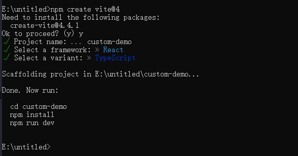

## 从零开始搭建后台管理系统

技术栈：
react：用于构建UI界面
react-router-dom：用于管理路由
react-redux：用于管理状态
@reduxjs/toolkit：用于管理redux
antd：用于构建UI组件
axios：用于处理网络请求
ahooks: hooks
less：用于编写样式
vite::用于构建项目
typescript: 类型检查
eslint: 代码规范检查
prettier: 代码格式化
tailwindcss: 原子css
yarn: 包管理器

## 项目结构

```bash
custom-demo
├─ .browserslistrc # 浏览器兼容性配置
├─.env.development # 开发环境变量
├─.env.production # 生产环境变量
├─.env.test # 测试环境变量
├─.env.staging # 预发布环境变量
├─.env.local # 本地环境变量
├─ .editorconfig # 编辑器配置
├─ .eslintignore # eslint忽略文件
├─ .eslintrc.cjs # eslint配置
├─ commitlint.config.cjs # commitlint配置
├─ index.html # html模板
├─ LICENSE # 许可证
├─ package.json # 项目配置
├─ postcss.config.cjs # postcss配置
├─ public # 静态资源
│  └─ vite.svg # 项目图标
├─ README.en.md # 英文文档
├─ .git # git忽略文件
├─ .gitee # gitee忽略文件
│  ├─ ISSUE_TEMPLATE.zh-CN.md # issue模板
│  └─ PULL_REQUEST_TEMPLATE.zh-CN.md # pr模板
├─ .github # github忽略文件
├─ .gitignore # git忽略文件
├─ .husky # husky配置
│  ├─ commit-msg # commit钩子
│  ├─ pre-commit # pre-commit钩子
│  └─ pre-push # pre-push钩子
├─ .prettierignore # prettier忽略文件
├─ .prettierrc.cjs # prettier配置
├─ .stylelintrc.cjs # stylelint配置
├─ src # 源码目录
│  ├─ api # api请求
│  ├─ App.tsx # 根组件
│  ├─ assets # 静态资源
│  │  └─ react.svg
│  ├─ components # 组件
│  │  ├─ index.ts # 导出组件
│  ├─ constant # 常量
│  │  └─ index.ts
│  ├─ language # 国际化
│  │  └─ index.ts
│  ├─ hooks # hooks
│  │  └─ index.ts # 导出hooks
│  ├─ layout # 布局
│  ├─ index.css # 全局样式
│  ├─ main.tsx # 入口文件
│  ├─ mock # mock数据
│  ├─ store # store
│  │  ├─ index.ts # 导出store
│  │  └─ module # store模块
│  ├─ types # 类型
│  ├─ utils # 工具
│  │  ├─ auth.ts # 权限工具
│  │  ├─ premission.ts # 权限工具
│  │  └─ request.ts # 网络请求工具
│  ├─ views # 视图
│  └─ vite-env.d.ts # 类型声明
├─ tailwind.config.cjs # tailwind配置
├─ tsconfig.json # typescript配置
├─ tsconfig.node.json # typescript配置
├─ vite.config.ts # vite配置
└─ yarn.lock # 依赖锁定文件

```

## 项目搭建

1. 使用vite

打开命令行工具，输入以下命令：

::: tabs

@tab npm
npm create vite@latest

@tab yarn
yarn create vite

@tab pnpm
pnpm create vite

:::

> project name:项目名称
>Select a framework:选择框架
>Select a variant:选择不同的语言



2. 安装依赖

```bash
cd custom-demo && npm i
```

3. 启动项目

```bash
npm run dev
```


这样就搭建好了一个简单的react项目

## 修改vite配置

在`vite.config.ts`中加入以下配置

```ts
 resolve: {
    alias: {
      '@':resolve(__dirname, './src')
    },
    extensions: ['.tsx', '.ts', '.jsx', '.js']
  },
  server: {
    port: 8080,
    host: '0.0.0.0',
    cors:true
  }
```

## 配置路由

```bash
npm i react-router-dom -S
```

1. 在`src`文件夹下创建`router`文件夹，用于存放路由

2. 在`router`文件夹下创建`base-router.ts`文件，用于配置路由

3. 在`base-router.ts`文件中配置路由

```tsx
import { FC, Fragment, lazy, ReactElement } from 'react'
import { Navigate, type RouteObject } from 'react-router-dom'
import auth from '@/utils/auth'
const Layout = lazy(() => import('@/layout'))
const Home = lazy(() => import('@/views/Home'))
const About = lazy(() => import('@/views/About'))
const Login = lazy(() => import('@/views/Login'))
type Props = {
  children?: ReactElement
}
export const Auth: FC<Props> = ({ children }: Props) => {
  const token = auth.getToken()
  return token ? <Fragment>{children}</Fragment> : <Navigate to={'/login'} />
}
const routes: RouteObject[] = [
  {
    path: '/',
    element: (
      <Auth>
        <Layout />
      </Auth>
    ),
    children: [
      { path: '', element: <Home /> },
      {
        path: 'about',
        element: <About />,
      },
    ],
  },
  {
    path: '/login',
    element: <Login />,
  },
]
export default routes
```

4. 在`router`文件夹下创建`index.tsx`文件，用于配置路由

5. 在`index.tsx`文件中配置路由

```tsx
import { Suspense } from 'react'
import { type RouteObject, useRouteError } from 'react-router-dom'
import { Spinner } from '@/components'
import routes from './base-router'
const router: RouteObject[] = [...routes]
export const ErrorBoundary = () => {
  const error = useRouteError()
  return error ? <h1>{error.message}</h1> : <h1></h1>
}
function routingConversion(router: RouteObject[]): RouteObject[] {
  return router.map((route: RouteObject) => {
    const newRoute: RouteObject = {
      ...route,
      element: <Suspense fallback={<Spinner />}>{route.element}</Suspense>,
      errorElement: <ErrorBoundary />,
    }
    if (route.children) {
      newRoute.children = routingConversion(route.children)
    }
    return newRoute
  })
}

export { RouteObject, routingConversion }
export default routingConversion(router)
```

6. 在`src`下创建·`layout`文件夹，用于存放布局组件

7. 在`layout`文件夹下创建`index.tsx`文件，用于配置布局组件

8. 在`index.tsx`文件中配置布局组件

```tsx
import React from 'react'
import { useOutlet } from 'react-router-dom'
function Layout() {
  const RouterView = useOutlet()
  return (
    <div>
      sdhfhsd
      {RouterView}
    </div>
  )
}

export default Layout
```

9. 在`src`下创建`views`文件夹，用于存放视图组件

10. 在`views`文件夹下创建`Home/index.tsx`,`Login/index.tsx`,`Eorror/index.tsx`, `About/index.tsx`文件，用于配置视图组件

11. 在`Home/index.tsx`,`Login/index.tsx`,`Eorror/index.tsx`, `About/index.tsx`文件中配置视图组件

```tsx
// Home/index.tsx
import React from 'react'

function Home() {
  return <div>Home</div>
}
export default Home
// Login/index.tsx
import React from'react'
function Login() {
  return <div>Login</div>
}
export default Login
// Eorror/index.tsx
import React from'react'
function Error() {
  return <div>Error</div>
}
export default Error
// About/index.tsx
import React from'react'
function About() {
  return <div>About</div>
}
export default About
```

12. 在`src`下创建`components`文件夹，用于存放公共组件

13. 在`components`文件夹下创建`Spinner/index.tsx`文件，用于配置公共组件

```tsx
import React, { useEffect } from 'react'
import NProgress from 'nprogress'
import 'nprogress/nprogress.css'

function Spinner() {
  NProgress.start()
  useEffect(() => {
    NProgress.done()
  }, [])
  return <></>
}

export default Spinner

```

14. 在`components`文件夹下创建`index.ts`文件，加入以下代码：

```ts
export { default as Spinner } from './Spinner'

```

15. 在`App.tsx`中使用路由

```tsx
import { useSelector } from 'react-redux'
import { createHashRouter, RouterProvider } from 'react-router-dom'
import type { RootState } from '@/hooks'
function App() {
  const state = useSelector((state: RootState) => state.router)
  const routes = createHashRouter(state.router)
  return <RouterProvider router={routes}></RouterProvider>
}

export default App
```

## 配置状态管理

```bash
npm i react-redux @reduxjs/toolkit -S
```

1. 在`src`下创建`store`文件夹，用于存放状态管理

2. 在`store`文件夹下创建`index.ts`文件，用于配置状态管理

3. 在`index.ts`文件中配置状态管理

```ts
import { combineReducers, configureStore } from '@reduxjs/toolkit'
import routerReducer from './module/routes'
const store = configureStore({
  reducer: {
    route:routerReducer
  }
})
export default store
```

4. 在`main.tsx`中引入状态管理

```tsx
import React from'react'
import ReactDOM from'react-dom'
import App from './App'
import { Provider } from 'react-redux'
import store from './store'
ReactDOM.render(
  <React.StrictMode>
    <Provider store={store}>
      <App />
    </Provider>
  </React.StrictMode>,
  document.getElementById('root')
  )
```

5. 创建`module/routes.ts`文件

```ts
import { createSlice } from '@reduxjs/toolkit'
import router, { type RouteObject } from '@/router'

type State = {
  router: RouteObject[]
}
const initialState: State = {
  router,
}
const routerSlice = createSlice({
  name: 'router',
  initialState,
  reducers: {
    // 路由跳转
    routeChange(state, action) {
      state.router = action.payload
    },
  },
})
// Action creators are generated for each case reducer function
export const { routeChange } = routerSlice.actions

export default routerSlice.reducer
```

## 配置axios

```bash
npm i axios antd -S
```

1. 在`src`下创建`utils`文件夹，用于存放工具类

2. 在`utils`文件夹下创建`request.ts`文件，用于配置axios

3. 在`request.ts`文件中配置axios

```ts
import { message } from 'antd'
import Axios, { AxiosError, AxiosResponse } from 'axios'
import auth from './auth'
// 定义请求参数的类型
interface RequestParams {
  url: string
  method?: string
  data?: unknown
  params?: unknown
}
// 定义错误类型
interface MyError {
  message: string
  code: number
}
// 定义响应数据的类型
interface ResponseData<T> {
  code: number
  message: string
  data: T
}
const instance = Axios.create({
  baseURL: '',
  timeout: 5000,
})
// 请求拦截器
instance.interceptors.request.use(
  config => {
    const token = auth.getToken()
    if (token && config.headers) {
      config.headers.Authorization = token
    }
    return config
  },
  (err: AxiosError) => Promise.reject(err)
)
// 响应拦截器
instance.interceptors.response.use(
  (response: AxiosResponse) => response.data,
  (err: AxiosError<MyError>) => {
    const errorData = err.response?.data
    const message = errorData?.message ?? 'Unknown error'
    const error: MyError = { message, code: errorData?.code ?? 500 }
    return Promise.reject(error)
  }
)
const request = async <T>(config: RequestParams): Promise<ResponseData<T>> => {
  try {
    const response = await instance.request<ResponseData<T>>({ ...config })
    return response.data
  } catch (error) {
    const errMessage = (error as MyError).message
    message.error(errMessage || '请求出错')
    throw new Error(errMessage || '请求出错')
  }
}

export default request
```

4. 创建`auth.ts`文件，加入以下代码：

```ts
import { TOKEN_KEY } from '@/constain'

const auth = {
  getToken: (): string => JSON.parse(localStorage.getItem(TOKEN_KEY) || ' '),
  setToken: (token: string): void =>
    localStorage.setItem(TOKEN_KEY, JSON.stringify(token)),
  removeToken: () => localStorage.removeItem(TOKEN_KEY),
  clearToken: () => localStorage.clear(),
}

export default auth

```

5. 在`src`下创建`contain/index.ts`文件，加入以下代码：

```ts
export const TOKEN_KEY = 'ADMIN_TOKEN'
```

## 配置@reduxjs/toolkit 持久化

```bash
npm i redux-persist -S
```

1. 修改`src/store/index.ts`内容，代码如下：

```ts
import { combineReducers, configureStore } from '@reduxjs/toolkit'
import {
  FLUSH,
  PAUSE,
  PERSIST,
  persistReducer,
  persistStore,
  PURGE,
  REGISTER,
  REHYDRATE,
} from 'redux-persist'
import storage from 'redux-persist/lib/storage' // localStorage 或 AsyncStorage
import routerReducer from './module/routes'
// 定义持久化配置
const persistConfig = {
  key: 'root', // 用于在存储引擎中标识你的数据
  storage, // 使用的存储引擎
  blacklist: ['router'], // 排除不需要持久化的部分
}
const rootReducer = combineReducers({
  router: routerReducer,
})
// 创建持久化 reducer
const persistedReducer = persistReducer(persistConfig, rootReducer)
const store = configureStore({
  reducer: persistedReducer,
  middleware: getDefaultMiddleware =>
    getDefaultMiddleware({
      serializableCheck: {
        //忽略了 Redux Persist 调度的所有操作类型。这样做是为了在浏览器控制台读取a non-serializable value was detected in the state时不会出现错误。
        ignoredActions: [FLUSH, REHYDRATE, PAUSE, PERSIST, PURGE, REGISTER],
      },
    }),
})
// 创建持久化的 store
const persistor = persistStore(store)
export { store, persistor }

```

2. 修改`main.tsx`内容，代码如下：

```ts
import React from 'react'
import ReactDOM from 'react-dom/client'
import { Provider } from 'react-redux'
import { PersistGate } from 'redux-persist/integration/react'
import App from './App.tsx'
import { persistor, store } from './store'
import './index.css'
ReactDOM.createRoot(document.getElementById('root')!).render(
  <Provider store={store}>
    <PersistGate loading={null} persistor={persistor}>
      <App />
    </PersistGate>
  </Provider>
)
```

## 配置eslint和prettier

1. 安装依赖

```bash
npm i eslint prettier eslint-config-prettier eslint-plugin-simple-import-sort -D
```

2. 使用 命令创建配置文件

```bash
npx eslint --init
```

3. 选择`Use a popular style guide`选项，选择`Airbnb`风格，然后选择`typescript`语言，最后选择`Use a different formatter`选项，选择`Prettier`格式化工具。

4. 修改`.eslintrc.js`文件，文件重命名为：`.eslintrc.cjs`,内容如下

```js
module.exports = {
  root: true,
  env: {
    browser: true,
    es2020: true
  },
  extends: [
    'eslint:recommended',
    'plugin:@typescript-eslint/recommended',
    'plugin:react-hooks/recommended',
  ],
  parser: '@typescript-eslint/parser',
  "parserOptions": {
    "ecmaVersion": "latest",
    "sourceType": "module"
  },
  plugins: ['react-refresh',
    "@typescript-eslint", "simple-import-sort"
  ],
  rules: {
    "simple-import-sort/imports": [
      "error",
      {
        groups: [
          [
            '^react',
            // 以字母(或数字或下划线)或“@”后面跟着字母开头的东西,通常为nodeModules引入
            '^@?\\w',
            '^@(/.*|$)', // 内部导入 "@/"
            '^\\.\\.(?!/?$)', // 父级导入. 把 `..` 放在最后.
            '^\\.\\./?$',
            // 同级导入. 把同一个文件夹.放在最后
            '^\\./(?=.*/)(?!/?$)',
            '^\\.(?!/?$)',
            '^\\./?$',
            '^.\\.?(css|less|scss)$', // 样式导入.
            '^\\u0000', // 带有副作用导入，比如import 'a.css'这种.
          ],
        ]
      }
    ],
    semi: ['error', 'never'],
    'no-unused-vars': [
      'warn',
      {
        args: 'none',
        ignoreRestSiblings: true,
      },
    ],
    'no-console': process.env.VITE_APP_ENV === 'production' ? 2 : 0,
    'array-callback-return': 'off',
    eqeqeq: ["warn", "allow-null"],
    quotes: ['error', 'single'],
    "no-extra-semi": "error",
    "semi-spacing": ["error", { "before": false, "after": true }]
  }
}
```

5. 创建`.prettierrc.cjs`文件，内容如下

```js
module.exports = {
  // 箭头函数只有一个参数的时候可以忽略括号
  arrowParens: 'avoid',
  // 括号内部不要出现空格
  bracketSpacing: true,
  // 行结束符
  endOfLine: 'auto',
  // 行宽
  printWidth: 80,
  // 换行方式
  proseWrap: 'preserve',
  // 分号
  semi: false,
  // 使用单引号
  singleQuote: true,
  // 缩进
  tabWidth: 2,
  // 使用tab缩进
  useTabs: false,
  // 后置逗号，多行对象、数组在最后一行增加逗号
  trailingComma: 'es5',
  parser: 'typescript',
}
```

6. 创建 `.prettierignore`和`.eslintignore`文件，加入以下内容：

```txt
node_modules
dist
public
.vscode
.husky
.gitignore
*.html
dist
.eslintrc.cjs
commitlint.config.cjs
.prettierrc.cjs
tailwind.config.cjs
postcss.config.cjs
```

## 配置tailwindcss

1. 安装依赖

```bash
npm i tailwindcss postcss autoprefixer -D
```

2. 创建`tailwind.config.cjs`文件，内容如下：

```js
/** @type {import('tailwindcss').Config} */
module.exports = {
  content: ["./src/**/*.{js,tsx,tsx}"],
  theme: {
    extend: {},
  },
  plugins: [],
}
```

3. 创建`postcss.config.cjs`文件，内容如下：

```js
module.exports = {
  plugins: {
    tailwindcss: {},
    autoprefixer: {},
  }
}

```

4. 修改`src/index.css`文件，内容如下：

```css
@tailwind base;
@tailwind components;
@tailwind utilities;
```

## 配置husky 和 commitlint、lint-staged,git-cz

1. 安装依赖

```bash
npm install -D husky lint-staged @commitlint/cli @commitlint/config-conventional @commitlint/prompt-cli git-cz
```

2. 执行下面的命令，向`package.json` 文件中加入脚本：

```bash
npm pkg set scripts.prepare="husky install"
```

3. 启用`git`钩子：

```bash
npm run prepare
```

4. 新增一个`pre-commit`钩子，以便在代码提交之前运行npm命令：

```bash
npx husky add .husky/pre-commit "npx lint-staged"
```

5. 添加`lint-staged`配置到`package.json`：

```json
{
  "lint-staged": {
    "*.{ts,tsx,js,jsx,cjs,mjs}": "eslint --fix",
    "*.{ts,tsx,js,jsx,cjs,mjs,css,scss,md}": "prettier --write"
  }
}
```

6. 创建`commitlint.config.cjs`文件，内容如下：

```js
// @see: https://cz-git.qbenben.com/zh/guide
/** @type {import('cz-git').UserConfig} */

module.exports = {
 extends: ['@commitlint/config-conventional'],
 rules: {
  // @see: https://commitlint.js.org/#/reference-rules
  'body-leading-blank': [2, 'always'],
  'footer-leading-blank': [1, 'always'],
  'header-max-length': [2, 'always', 108],
  'subject-empty': [2, 'never'],
  'type-empty': [2, 'never'],
  'subject-case': [0],
  'type-enum': [
   2,
   'always',
   [
    'feat',
    'fix',
    'docs',
    'style',
    'refactor',
    'perf',
    'test',
    'build',
    'ci',
    'chore',
    'revert',
    'wip',
    'workflow',
    'types',
    'release'
   ]
  ]
 },
 prompt: {
  messages: {
   // type: "Select the type of change that you're committing:",
   // scope: 'Denote the SCOPE of this change (optional):',
   // customScope: 'Denote the SCOPE of this change:',
   // subject: 'Write a SHORT, IMPERATIVE tense description of the change:\n',
   // body: 'Provide a LONGER description of the change (optional). Use "|" to break new line:\n',
   // breaking:
   //  'List any BREAKING CHANGES (optional). Use "|" to break new line:\n',
   // footerPrefixsSelect:
   //  'Select the ISSUES type of changeList by this change (optional):',
   // customFooterPrefixs: 'Input ISSUES prefix:',
   // footer: 'List any ISSUES by this change. E.g.: #31, #34:\n',
   // confirmCommit: 'Are you sure you want to proceed with the commit above?'
   // 中文版
   type: '选择你要提交的类型 :',
   scope: '选择一个提交范围（可选）:',
   customScope: '请输入自定义的提交范围 :',
   subject: '填写简短精炼的变更描述 :\n',
   body: '填写更加详细的变更描述（可选）。使用 "|" 换行 :\n',
   breaking: '列举非兼容性重大的变更（可选）。使用 "|" 换行 :\n',
   footerPrefixsSelect: '选择关联issue前缀（可选）:',
   customFooterPrefixs: '输入自定义issue前缀 :',
   footer: '列举关联issue (可选) 例如: #31, #I3244 :\n',
   confirmCommit: '是否提交或修改commit ?'
  },
  types: [
   // {
   //  value: 'feat',
   //  name: 'feat:     🚀  A new feature',
   //  emoji: '🚀'
   // },
   // {
   //  value: 'fix',
   //  name: 'fix:      🧩  A bug fix',
   //  emoji: '🧩'
   // },
   // {
   //  value: 'docs',
   //  name: 'docs:     📚  Documentation only changes',
   //  emoji: '📚'
   // },
   // {
   //  value: 'style',
   //  name: 'style:    🎨  Changes that do not affect the meaning of the code',
   //  emoji: '🎨'
   // },
   // {
   //  value: 'refactor',
   //  name: 'refactor: ♻️   A code change that neither fixes a bug nor adds a feature',
   //  emoji: '♻️'
   // },
   // {
   //  value: 'perf',
   //  name: 'perf:     ⚡️  A code change that improves performance',
   //  emoji: '⚡️'
   // },
   // {
   //  value: 'test',
   //  name: 'test:     ✅  Adding missing tests or correcting existing tests',
   //  emoji: '✅'
   // },
   // {
   //  value: 'build',
   //  name: 'build:    📦️   Changes that affect the build system or external dependencies',
   //  emoji: '📦️'
   // },
   // {
   //  value: 'ci',
   //  name: 'ci:       🎡  Changes to our CI configuration files and scripts',
   //  emoji: '🎡'
   // },
   // {
   //  value: 'chore',
   //  name: "chore:    🔨  Other changes that don't modify src or test files",
   //  emoji: '🔨'
   // },
   // {
   //  value: 'revert',
   //  name: 'revert:   ⏪️  Reverts a previous commit',
   //  emoji: '⏪️'
   // }
   // 中文版
   { value: '特性', name: '特性:   🚀  新增功能', emoji: '🚀' },
   { value: '修复', name: '修复:   🧩  修复缺陷', emoji: '🧩' },
   { value: '文档', name: '文档:   📚  文档变更', emoji: '📚' },
   {
    value: '格式',
    name: '格式:   🎨  代码格式（不影响功能，例如空格、分号等格式修正）',
    emoji: '🎨'
   },
   {
    value: '重构',
    name: '重构:   ♻️  代码重构（不包括 bug 修复、功能新增）',
    emoji: '♻️'
   },
   { value: '性能', name: '性能:   ⚡️  性能优化', emoji: '⚡️' },
   {
    value: '测试',
    name: '测试:   ✅  添加疏漏测试或已有测试改动',
    emoji: '✅'
   },
   {
    value: '构建',
    name: '构建:   📦️  构建流程、外部依赖变更（如升级 npm 包、修改 webpack 配置等）',
    emoji: '📦️'
   },
   { value: '集成', name: '集成:   🎡  修改 CI 配置、脚本', emoji: '🎡' },
   { value: '回退', name: '回退:   ⏪️  回滚 commit', emoji: '⏪️' },
   {
    value: '其他',
    name: '其他:   🔨  对构建过程或辅助工具和库的更改（不影响源文件、测试用例）',
    emoji: '🔨'
   }
  ],
  useEmoji: true,
  themeColorCode: '',
  scopes: [],
  allowCustomScopes: true,
  allowEmptyScopes: true,
  customScopesAlign: 'bottom',
  customScopesAlias: 'custom',
  emptyScopesAlias: 'empty',
  upperCaseSubject: false,
  allowBreakingChanges: ['feat', 'fix'],
  breaklineNumber: 100,
  breaklineChar: '|',
  skipQuestions: [],
  issuePrefixs: [
   { value: 'closed', name: 'closed:   ISSUES has been processed' }
  ],
  customIssuePrefixsAlign: 'top',
  emptyIssuePrefixsAlias: 'skip',
  customIssuePrefixsAlias: 'custom',
  allowCustomIssuePrefixs: true,
  allowEmptyIssuePrefixs: true,
  confirmColorize: true,
  maxHeaderLength: Infinity,
  maxSubjectLength: Infinity,
  minSubjectLength: 0,
  scopeOverrides: undefined,
  defaultBody: '',
  defaultIssues: '',
  defaultScope: '',
  defaultSubject: ''
 }
}
```

7. 执行下面的命令，向`package.json` 文件中加入脚本：

```bash
npm pkg set scripts.commit="git pull && git add . && git-cz && git push"
```

## 配置stylelint

1. 安装：

```bash
npm install stylelint stylelint-config-standard stylelint-config-prettier stylelint-config-standard-scss --save-dev
```

2. 配置：

```js
module.exports = {
  "extends": [
    "stylelint-config-standard",
    "stylelint-config-prettier",
    "stylelint-config-standard-scss"
  ],
  "customSyntax": "postcss-lit",
  "rules": {
    "property-no-unknown": true,
    "comment-no-empty": [
      true,
      {
        "message": "禁止空注释"
      }
    ],
    "indentation": null,
    "keyframes-name-pattern": null,
    "no-descending-specificity": null,
    "function-url-quotes": "always",
    "string-quotes": "single",
    "unit-case": null,
    "color-hex-case": "lower",
    "color-hex-length": "short",
    "font-family-no-missing-generic-family-keyword": null,
    "block-opening-brace-space-before": "always",
    "no-empty-source": null,
    "declaration-block-trailing-semicolon": null,
    "selector-class-pattern": null,
    "value-no-vendor-prefix": null,
    "at-rule-no-unknown": null,
    'order/properties-order': [
      // 规则顺序
      'position',
      'top',
      'right',
      'bottom',
      'left',
      'z-index',
      'display',
      'float',
      'width',
      'height',
      'max-width',
      'max-height',
      'min-width',
      'min-height',
      'padding',
      'padding-top',
      'padding-right',
      'padding-bottom',
      'padding-left',
      'margin',
      'margin-top',
      'margin-right',
      'margin-bottom',
      'margin-left',
      'margin-collapse',
      'margin-top-collapse',
      'margin-right-collapse',
      'margin-bottom-collapse',
      'margin-left-collapse',
      'overflow',
      'overflow-x',
      'overflow-y',
      'clip',
      'clear',
      'font',
      'font-family',
      'font-size',
      'font-smoothing',
      'osx-font-smoothing',
      'font-style',
      'font-weight',
      'line-height',
      'letter-spacing',
      'word-spacing',
      'color',
      'text-align',
      'text-decoration',
      'text-indent',
      'text-overflow',
      'text-rendering',
      'text-size-adjust',
      'text-shadow',
      'text-transform',
      'word-break',
      'word-wrap',
      'white-space',
      'vertical-align',
      'list-style',
      'list-style-type',
      'list-style-position',
      'list-style-image',
      'pointer-events',
      'cursor',
      'background',
      'background-color',
      'border',
      'border-radius',
      'content',
      'outline',
      'outline-offset',
      'opacity',
      'filter',
      'visibility',
      'size',
      'transform',
    ],
  }
}

```

3. 执行：

```bash
npx stylelint "**/*.css"
```

## 配置editor

新建一个文件`.editorconfig`,加入以下内容：

```txt
# https://editorconfig.org

root = true

[*] //表示所有的文件都可用
charset = utf-8 //设置文件的字符集
indent_style = space //缩进的风格是space 回车键
indent_size = 2//缩进大小是2
end_of_line = lf //缩进类型视lf
insert_final_newline = true //始终再文章末尾进入一个新行
trim_trailing_whitespace = true //移除无效空格

[*.md] //表示md文档只需要尊行以下规则
insert_final_newline = false
trim_trailing_whitespace = false

```

end ：初始化配置就已经完成了(后续考虑增加国际化配置)
